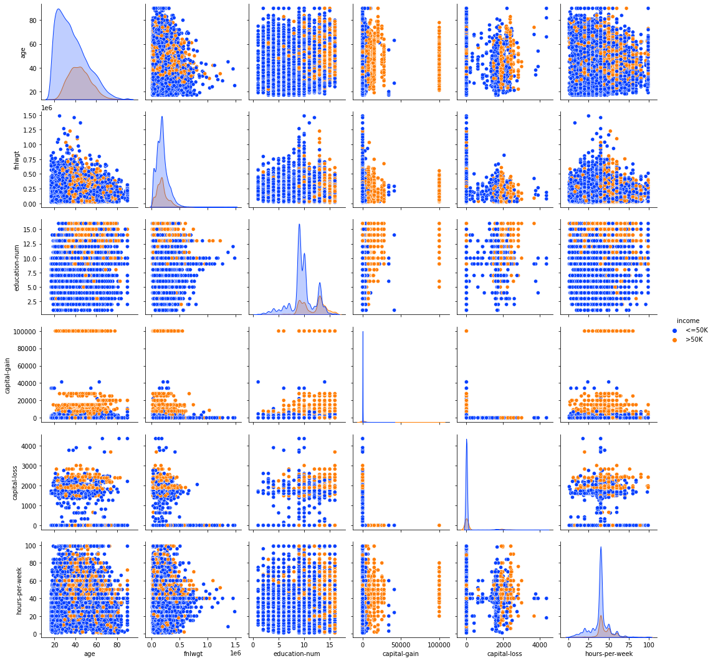

# Portfolio

## 🚙⚡ EV Charging Station Optimization
### Introduction:
Electric vehicles have become one of the largest talking points of the 21st century in The United States of America. The growth of registered electric vehicles has continued to increase year over year, but it seems that the growth has been stunted due to the difficulty of expanding the charging station infrastructure proportionally. Deploying more charging stations plays a pivotal role in fostering the widespread adoption of electric vehicles. Due to the slow growth in charging station infrastructure, it is vital to make strategic decisions on new placements. The strategic placement of charging stations must prove convenient to electric vehicle users and alleviate range anxiety. In this project, our team presents a detailed analysis and development of a user interface that utilizes advanced predictive modeling techniques to strategically predict the placement of a new charging station. We are able to do this by leveraging existing charging station locations, current registered electric vehicles, mean incomes per ZIP Code, year over year growth, as well as other important factors that proved to be significant throughout our modeling. Our project’s motivation is to enhance accessibility and efficiency of the electric vehicle charging station ecosystem, in turn promoting the transition towards sustainable transportation.

### Problem Definition:
Electric vehicle adoption is bottlenecked by the slow expansion of the charging station ecosystem. The goal of our project is to create a user interface that identifies the next best placement of a charging station using a series of advanced predictive models based on data from existing charging station locations, registered electric vehicles and other important demographic factors that our models consider significant. This user interface can be a valuable tool for proposing future expansions, and minimizes the resources needed to foster the growth of the electric vehicle charging station ecosystem. 

## 🍄 Edible or Deadible? An Image Based and Feature Based Approach to Classifing Poisonous Mushrooms
### Problem Statement
Mushrooms are a fascinating and diverse group of fungi that are found all around the world. While they are extremely common, the potential risks associated with consuming the wrong type of mushroom cannot be overstated. Some mushrooms can be fatal if ingested, while others may simply be unpalatable or cause mild to severe hallucinations. Therefore, having the knowledge to distinguish between edible mushrooms and those that are poisonous or otherwise harmful is incredibly valuable.
Our goal is to develop a sophisticated model that utilizes images of various mushrooms, including those that are poisonous, unpalatable, hallucinogenic, and safely edible. By leveraging this dataset of images, we aim to create a classification model that can accurately determine whether a mushroom is safe to eat or should be avoided due to its toxicity. This model will not only enhance our understanding of mushroom identification but could also serve as a critical tool for foragers, hikers, and anyone interested in safely exploring the world of mushrooms.

### Model Summaries
### 📸 Image-Based Models
🔹 Logistic Regression (PCA-Reduced Images)
Method: Applied PCA to reduce image dimensionality before running logistic regression.
Result:  
Accuracy: 54.8%  
Precision: 46.6%  
Recall: 52.3%  
F1 Score: 49.3%  
Note: Performed slightly better than random guessing; poor at identifying poisonous mushrooms reliably.

🔹 K-Nearest Neighbors (KNN)
Method: PCA-reduced images with various K-values tested; best results at K=18.
Result:  
Accuracy: 59.6%  
Precision: 59.0%  
Recall: 58.3%  
F1 Score: 58.1%  
Note: Outperformed logistic regression but still lacked strong performance for safety-critical classification.

🔹 Convolutional Neural Network (CNN)
Method: Used Keras Sequential model with convolutional, pooling, dropout, and dense layers. Trained for 30 epochs.
Result:  
Accuracy: 63.4%  
Precision: 47.5%  
Recall: 57.8%  
F1 Score: 52.1%  
Note: Best image-based model, but high false positives made it unsafe for practical edible-vs-poisonous classification.

### 📊 Feature-Based (CSV) Models
🔹 Logistic Regression (Categorical Data)
Method: Used UCI mushroom dataset with 70/30 train-test split.
Result:  
Accuracy: 95%  
Note: High-performing and interpretable; great use of categorical features. Adjusting threshold could further reduce risk of false positives.

🔹 CART (Classification and Regression Tree)
Method: Used label encoding on categorical data. Initial tree was pruned to avoid overfitting.
Result:  
Accuracy: 90% (after pruning)  
Note: Highly interpretable model with strong performance, especially for detecting poisonous mushrooms.

### 🏁 Final Thoughts
Best-performing models: CSV-based Logistic Regression and CART due to the rich, structured categorical features.  
Image-only models: Underperformed overall due to lack of clear visual separability in the mushroom images.  
Recommendation: Consider combining a few user-provided features with an image upload to create a hybrid model that improves both accuracy and usability.

## Income Level Prediction

### Introduction
The year is 1999 and Big Finance Bank is looking to use the new analytics methodologies to build a model that allows their analysts to determine an individuals income. Big Finance Bank would like to use the census data collected to build a model that classifies an individual as less than or greater than 50,000. In today's day, 50,000 is equivalent to roughly 103,000. Big Finance Bank hopes to learn more about the trends associated with higher income earners based off a mix of categorical and quantitative data. The bank would like to determine what factors are more important for determining income level as well as building a model that could accurately predict income level based off these demographic traits. The data is collected from: https://archive.ics.uci.edu/dataset/2/adult. See below for the quantitative data behavior trends.
  

### Interpreting the Results
### 📊 Classification Report

**Accuracy**: 0.8087

| Class | Precision | Recall | F1-Score | Support |
|-------|-----------|--------|----------|---------|
| 0     | 0.77      | 0.32   | 0.45     | 3700    |
| 1     | 0.81      | 0.97   | 0.88     | 11360   |
| **Accuracy** |       |        | **0.81** | 15060   |
| **Macro Avg** | 0.79 | 0.64   | 0.67     | 15060   |
| **Weighted Avg** | 0.80 | 0.81 | 0.78     | 15060   |

Using the SVM method allowed for an 81% accurate model to be created. This means that 81% of the data can be explained by the model suggesting a strong correlation between the factors used in the data and income level. The precision ratio of 0 or '<=50K' is less than 1 or '>50k', suggests the higher precision leads to fewer false positives. The same can be applied to the recall value with a lower 0 value indicates fewer false negatives. This could be potentially explained by the larger representation of class 1 data in the data set. While class 0 is important to understand in the context of the bank, further investigation is likely required. The coefficents of the equation also help indicate which factors are more important in determining the response than others. Workclass, marital-status, occupation, relationship, race and native-country appear to be the least influential on the model. Native-country included a large number of options so it would be a good idea to further investigate if one of the higher ranked native-countries is more influential than the rest. Overall, the model predicts the income level well with an accuracy of 81%. Big Finance bank now knows what factors are more important to the others and can use this model to predict income level.

## [🧠 Jarvis 2.0 – Voice-Activated AI Assistant](https://github.com/timothyeriordan/Portfolio/blob/main/speech_recognition.py)

This Python script implements a voice-activated virtual assistant named Jarvis 2.0. It listens for user commands, responds via speech, and can intelligently answer questions by querying Wolfram Alpha for math/computational queries and Wikipedia for general knowledge.

### 🔍 Key Features
Voice Recognition: Uses the microphone to listen and process voice commands via Google Speech Recognition.
Text-to-Speech: Responds to commands using pyttsx3 for natural-sounding voice output.
Intelligent Question Answering:
Uses Wolfram Alpha to handle mathematical or factual computations.
Falls back to Wikipedia for general knowledge or historical events.
Browser Navigation: Can open websites using Chrome.
Note Taking: Allows voice-based note-taking and saves the note as a timestamped .txt file.
Custom Wake Word: Only activates when the command starts with the keyword "jarvis".

### 💡 Example Commands
"Jarvis compute 2 plus 2" → Will return and speak the result via Wolfram Alpha.  
"Jarvis wikipedia Isaac Newton" → Reads out a summary from Wikipedia.  
"Jarvis say hello" → Responds with a greeting.  
"Jarvis go to google.com" → Opens Google in Chrome.  
"Jarvis log" → Starts recording a note via voice.  
"Jarvis exit" → Gracefully exits the assistant.  

### ⚙️ Requirements
Python 3.x  
speechrecognition  
pyttsx3  
wikipedia  
wolframalpha  
pyaudio (for microphone input)  
Chrome browser (predefined path required for web navigation)  
<a href="https://github.com/timothyeriordan/Portfolio/blob/main/speech_recognition.py" target="_blank">Jump to Jarvis 2.0</a>
